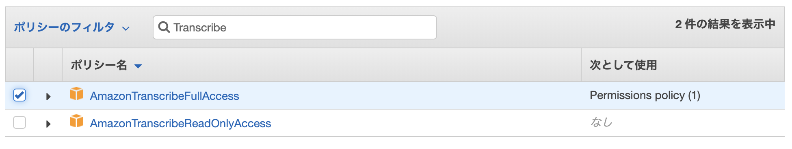

# はじめての自然言語処理（NLP：Natural Language Processing）ハンズオン
## LINE Botを作成する
このLINE Botではテキスト送信、音声送信を受け付けることができます。テキスト送信する場合は英語で送信してみてください。Amazon Translateを使い、日本語へ翻訳したテキストを返します。[the japan times alpha](https://alpha.japantimes.co.jp/) などを利用すると和訳も読むことができます。こちらのテキストを送信することでAmazon Translateのパワーを確認できるはずです。  

音声送信の場合は、日本語でLINE Botに話しかけてみてください。音声をAmazon S3にアップロードして音声文字起こしを開始します。文字起こしが完了するとテキストがLINE Botに送信されます。

### LINE Developers
LINE Botを作成するために、LINE Developersへの登録が必要となります。

[Messaging APIを利用するには](https://developers.line.biz/ja/docs/messaging-api/getting-started/#%E3%83%81%E3%83%A3%E3%83%8D%E3%83%AB%E3%81%AE%E4%BD%9C%E6%88%90) を参考にLINE Developersコンソールにログインし、チャネルの種類：**Messaging API**作成してください。

作成が完了したら、チャネルシークレットとチャネルアクセストークン（ロングターム）を取得しメモしておきます。  

#### チャネルシークレット
チャネルのページにアクセスしスクロールしていくと項目があります。発行をクリックし、発行されたシークレットをメモしておいてください。

#### チャネルアクセストークン
Messaging API設定のタブにアクセスし、スクロールするとチャネルアクセストークンの項目があります。発行をクリックしチャネルアクセストークンをメモしておいてください。

### IAM
Lambdaに利用するIAMロールを作成します。IAM > ロールへアクセスし、ロールを作成をクリックしてください。

Lambda用のロールを作成するので、サービスでLambdaを選択してアクセス権限をクリックしてください。

LambdaからAmazon Translate, Amazon S3, Amazon CloudWatch Logsへアクセスが必要なのでポリシーを選択し次のステップ：タグをクリックしてください。
追加するポリシーはAWSのマネージドポリシーを利用します。

* TranslateFullAccess
* AmazonS3FullAccess
* CloudWatchLogsFullAccess

タグの設定はスキップし、作成するロールの確認後ロールの作成をクリックします。ロールが正常に作成されるとメッセージが表示されます。

### Amazon S3
LINE Botから送信される音声を保存するS3バケットを作成します。Amazon S3にアクセスし、バケットを作成するをクリックしてください。

バケットを作成するをクリック、任意のバケット名を入力し作成をクリックしてください。

作成が完了すると、バケット一覧にバケット名が表示されます。

バケット名は後ほどLambdaの設定で利用するのでメモしておいてください。

### Lambda
Lambda > 関数にアクセスし関数の作成をクリックしてください。

基本設定をしていきます、関数名は任意の名前を入力してください。ランタイムは、Node.js 12.xを、アクセス権限は既存のロールを使用するを選択し、先ほど作成したIAMロールをプルダウンから選んで関数の作成をクリックします。

作成が完了したらコードをデプロイしていきます。関数コードのセクションからコードエントリータイプを.zipファイルをアップロードにし、アップロードをクリックしてfunction.zipをアップロードし保存します。

次に基本設定、環境変数を修正します。スクロールしていくと下に該当のセクションがあります。まずは基本設定のタイムアウトを伸ばします。これは外部APIコールによる音声データの取得、S3への保存処理があるためです。環境変数はチャネルシークレット、チャネルアクセストークン、S3バケット名を外部から渡すために使用します。先ほどメモしておいたそれぞれをキーと値を保存します。

変数名|説明
---|---
CHANNEL_ACCESS_TOKEN|チャネルアクセストークン（ロングターム）
CHANNEL_SECRET|チャネルシークレット
TRANSCRIBE_BUCKET_NAME|S3バケット名

### Amazon API Gateway
API Gatewayを開き、HTTP APIの構築をクリックします。

統合タイプをLambdaにし、作成したリージョン・Lambda関数を選択します。API名は任意のものを入力し次へをクリックしてください。

ルートを設定します。LINEのWebhookはHTTP POSTで受ける必要があるので、メソッドをPOST、リソースパスは/webhookとしてください。統合ターゲットは自動で選択されているはずですのでそのまま次へをクリックしてください。

ステージの設定は、そのまま進めて次へをクリックしてください。確認画面が表示されるので、作成をクリックしてください。

作成が完了すると、一覧からAPIの詳細を確認できます。ステージセクションにAPIのURLが表示されていますのでメモしておいてください。実際のリクエストするURLはURL + /webhookとなります。

### LINE Developersと疎通
作成したAPIとLINE Botを疎通していきます。先ほどチャネルアクセストークンを取得した、チャネルのMessaging API設定に移動します。スクロールするとWebhook設定セクションがあるので、編集ボタンをクリックし先ほどのAPI URL + /webhookを入力して保存します。検証ボタンをクリックすることで、APIが正常に動いているか確認できます。検証がOKになりましたら、Webhookの利用をオンにします。

これでWebhookの設定は完了ですが、まだLINE公式アカウントが自動応答しているので、無効化します。LINE公式アカウント機能の応答メッセージを編集をクリックします。クリックするとLINE Official Account Managerに遷移します。応答設定 > 詳細設定 > 応答メッセージをオフにします。

これで公式アカウントからメッセージを送信すると作成したAPIにリクエストが飛び、処理を実行します。公式アカウントと友だちになるにはLINE Developersコンソール > チャネル > Messaging API設定内に表示されているQRコードをスマートフォンで読み込んでください。