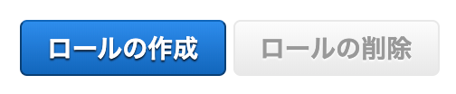

# はじめての自然言語処理（NLP：Natural Language Processing）ハンズオン
## LINE Botを作成する
このLINE Botではテキスト送信、音声送信を受け付けることができます。テキスト送信する場合は英語で送信してみてください。Amazon Translateを使い、日本語へ翻訳したテキストを返します。[the japan times alpha](https://alpha.japantimes.co.jp/) などを利用すると和訳も読むことができます。こちらのテキストを送信することでAmazon Translateのパワーを確認できるはずです。  

音声送信の場合は、日本語でLINE Botに話しかけてみてください。音声をS3にアップロードして音声文字起こしを開始します。文字起こしが完了するとテキストがLINE Botに送信されます。

### LINE Developers
LINE Botを作成するために、LINE Developersへの登録が必要となります。

[Messaging APIを利用するには](https://developers.line.biz/ja/docs/messaging-api/getting-started/#%E3%83%81%E3%83%A3%E3%83%8D%E3%83%AB%E3%81%AE%E4%BD%9C%E6%88%90) を参考にLINE Developersコンソールにログインし、チャネルの種類：**Messaging API**作成してください。

作成が完了したら、チャネルシークレットとチャネルアクセストークン（ロングターム）を取得しメモしておきます。  

#### チャネルシークレット
チャネルのページにアクセスしスクロールしていくと項目があります。発行をクリックし、発行されたシークレットをメモしておいてください。

#### チャネルアクセストークン
Messaging API設定のタブにアクセスし、スクロールするとチャネルアクセストークンの項目があります。発行をクリックしチャネルアクセストークンをメモしておいてください。

### AWS IAM
AWS Lambdaに利用するIAMロールを作成します。IAMのロールへアクセスしてください。ロールを作成をクリックしてください。

Lambda用のロールを作成するので、サービスでLambdaを選択してアクセス権限をクリックしてください。

Lambda関数からAmazon Translate, Amazon S3, Cloud Watch Logsへアクセスが必要なのでポリシーを選択し次のステップ：タグをクリックしてください。

追加するポリシーはAWSのマネージドポリシーを利用します。

* TranslateFullAccess
* AmazonS3FullAccess
* CloudWatchLogsFullAccess

タグの設定はスキップし、作成するロールの確認後ロールの作成をクリックします。ロールが正常に作成されるとメッセージが表示されます。

### Amazon S3
LINE Botから送信される音声を保存するS3バケットを作成します。S3にアクセスし、バケットを作成するをクリックしてください。

バケットを作成するをクリック、任意のバケット名を入力し作成をクリックしてください。

作成が完了すると、バケット一覧にバケット名が表示されます。

### AWS Lambda

### Amazon API Gateway